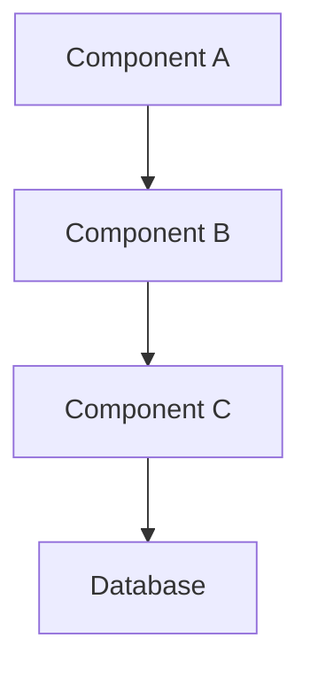

# ADR-{XXX}: {Full Descriptive Title}

## Status
proposed

## Context
{Describe the context and problem statement. What is the issue that we're seeing that is motivating this decision? This section should be 3-5 paragraphs that clearly explain why we need to make this decision.}

### Current Situation
- {How does the system currently work in this area?}
- {What are the pain points or limitations?}
- {What triggered the need for this decision?}
- {Include specific examples or metrics if available}

### Requirements
**Functional Requirements:**
- {What functionality must be supported?}
- {What are the use cases?}
- {What are the user stories affected?}

**Non-Functional Requirements:**
- **Performance**: {Response time, throughput, resource usage targets}
- **Scalability**: {Expected growth, concurrent users, data volume}
- **Security**: {Authentication, authorization, data protection needs}
- **Maintainability**: {Code complexity, debugging, monitoring needs}
- **Reliability**: {Uptime requirements, failure recovery}
- **Compatibility**: {Integration requirements, backwards compatibility}

### Constraints
- **Technical**: {Existing technology stack limitations}
- **Business**: {Budget, timeline, regulatory requirements}
- **Team**: {Skill sets, team size, knowledge gaps}
- **External**: {Third-party dependencies, vendor limitations}

## Decision
We will {state the architectural decision that was made in one clear sentence}.

### Chosen Solution: {Solution Name}
{Provide a detailed description of what we will do. This should be 2-3 paragraphs explaining the solution at a high level.}

#### Implementation Details
**Architecture Overview:**
{Describe how this fits into the overall architecture}

**Key Components:**
- **{Component 1}**: {Purpose and responsibility}
- **{Component 2}**: {Purpose and responsibility}
- **{Component 3}**: {Purpose and responsibility}

**Data Flow:**
1. {Step 1 of how data moves through the system}
2. {Step 2}
3. {Step 3}

**Technology Stack:**
- **Language/Framework**: {Specific versions}
- **Libraries**: {Key dependencies}
- **Infrastructure**: {Deployment environment}

**Integration Points:**
- **{System A}**: {How it integrates}
- **{System B}**: {How it integrates}

**Migration Strategy:**
1. **Phase 1**: {What happens first}
   - Timeline: {X weeks}
   - Risk: {Low/Medium/High}
2. **Phase 2**: {What happens next}
   - Timeline: {X weeks}
   - Risk: {Low/Medium/High}

## Consequences

### Positive Consequences
- ✅ **{Benefit 1}**: {Detailed explanation of why this is good}
- ✅ **{Benefit 2}**: {How this improves the system}
- ✅ **{Benefit 3}**: {What problems this solves}
- ✅ **{Benefit 4}**: {Future opportunities this enables}

### Negative Consequences
- ❌ **{Drawback 1}**: {What we're giving up or complicating}
- ❌ **{Drawback 2}**: {Technical debt we're accepting}
- ❌ **{Drawback 3}**: {Risks we're introducing}

### Neutral Consequences
- ➖ **{Change 1}**: {Things that will be different but not necessarily better/worse}
- ➖ **{Change 2}**: {Side effects to be aware of}

### Long-term Impact
- **1 Year**: {Expected state}
- **3 Years**: {Expected evolution}
- **5 Years**: {Potential migration needs}

## Alternatives Considered

### Option 1: {Alternative Name}
**Description**: {1-2 paragraphs describing this alternative approach}

**Pros**:
- ✅ {Advantage that this option has}
- ✅ {Another benefit}
- ✅ {Performance or simplicity gains}

**Cons**:
- ❌ {Disadvantage}
- ❌ {Limitation}
- ❌ {Risk or complexity}

**Estimated Effort**: {Low/Medium/High}
**Risk Level**: {Low/Medium/High}

**Reason for rejection**: {Clear explanation of why we didn't choose this, referencing specific requirements or constraints}

### Option 2: {Alternative Name}
**Description**: {1-2 paragraphs describing this alternative approach}

**Pros**:
- ✅ {Advantage that this option has}
- ✅ {Another benefit}

**Cons**:
- ❌ {Disadvantage}
- ❌ {Limitation}

**Estimated Effort**: {Low/Medium/High}
**Risk Level**: {Low/Medium/High}

**Reason for rejection**: {Clear explanation of why we didn't choose this}

### Option 3: Do Nothing
**Description**: Keep the current implementation without changes.

**Pros**:
- ✅ No implementation effort required
- ✅ No risk of breaking existing functionality

**Cons**:
- ❌ {Current problems persist}
- ❌ {Technical debt continues to grow}
- ❌ {Opportunity cost}

**Reason for rejection**: {Why the status quo is not acceptable}

## Decision Criteria
The following factors influenced this decision, listed in order of importance:

1. **{Criterion 1}** - Weight: High
   - {Why this matters}
   - {How each option scored}

2. **{Criterion 2}** - Weight: High
   - {Why this matters}
   - {How each option scored}

3. **{Criterion 3}** - Weight: Medium
   - {Why this matters}
   - {How each option scored}

4. **{Criterion 4}** - Weight: Low
   - {Why this matters}
   - {How each option scored}

## Implementation Plan

### Pre-requisites
- [ ] {What must be in place before we start}
- [ ] {Dependencies that need to be resolved}
- [ ] {Team training or hiring needs}

### Phase 1: Foundation (Week 1-2)
**Goal**: {What we'll accomplish in this phase}

**Tasks**:
- [ ] {Specific task 1}
- [ ] {Specific task 2}
- [ ] {Specific task 3}

**Deliverables**:
- {Concrete output 1}
- {Concrete output 2}

**Success Criteria**:
- {How we know this phase is complete}

### Phase 2: Core Implementation (Week 3-6)
**Goal**: {What we'll accomplish in this phase}

**Tasks**:
- [ ] {Specific task 1}
- [ ] {Specific task 2}
- [ ] {Specific task 3}
- [ ] {Specific task 4}

**Deliverables**:
- {Concrete output 1}
- {Concrete output 2}

**Success Criteria**:
- {How we know this phase is complete}

### Phase 3: Migration & Testing (Week 7-8)
**Goal**: {What we'll accomplish in this phase}

**Tasks**:
- [ ] {Migration task 1}
- [ ] {Testing task 1}
- [ ] {Documentation task 1}

**Deliverables**:
- {Test results}
- {Migration guide}
- {Updated documentation}

**Success Criteria**:
- {Performance benchmarks met}
- {All tests passing}
- {Zero data loss}

### Rollback Plan
If issues arise during implementation:
1. {Step 1 to safely rollback}
2. {Step 2 to restore previous state}
3. {Step 3 to communicate rollback}

### Success Metrics
We'll measure success using these KPIs:

**Technical Metrics**:
- **{Metric 1}**: Target: {value}, Measured by: {method}
- **{Metric 2}**: Target: {value}, Measured by: {method}
- **{Metric 3}**: Target: {value}, Measured by: {method}

**Business Metrics**:
- **{Metric 1}**: Target: {value}, Impact: {description}
- **{Metric 2}**: Target: {value}, Impact: {description}

**Quality Metrics**:
- **{Metric 1}**: Baseline: {current}, Target: {future}
- **{Metric 2}**: Baseline: {current}, Target: {future}

## Risks and Mitigations

### Technical Risks
| Risk | Probability | Impact | Mitigation Strategy |
|------|------------|--------|-------------------|
| {Risk 1} | High/Medium/Low | High/Medium/Low | {How we'll prevent or handle this} |
| {Risk 2} | High/Medium/Low | High/Medium/Low | {How we'll prevent or handle this} |
| {Risk 3} | High/Medium/Low | High/Medium/Low | {How we'll prevent or handle this} |

### Organizational Risks
| Risk | Probability | Impact | Mitigation Strategy |
|------|------------|--------|-------------------|
| {Risk 1} | High/Medium/Low | High/Medium/Low | {How we'll prevent or handle this} |
| {Risk 2} | High/Medium/Low | High/Medium/Low | {How we'll prevent or handle this} |

## References
- [{Reference 1 Title}]({URL}) - {Why this is relevant}
- [{Reference 2 Title}]({URL}) - {Why this is relevant}
- [{Reference 3 Title}]({URL}) - {Why this is relevant}
- [Internal Design Doc]({link}) - {Additional context}
- [Similar Implementation]({link}) - {How others solved this}

## Appendix

### A. Research Notes
{Any additional research, benchmarks, or analysis that informed this decision}

#### Performance Benchmarks
| Solution | Metric 1 | Metric 2 | Metric 3 |
|----------|----------|----------|----------|
| Current | {value} | {value} | {value} |
| Option 1 | {value} | {value} | {value} |
| Option 2 | {value} | {value} | {value} |
| Chosen | {value} | {value} | {value} |

### B. Meeting Notes
**{Date} - Initial Discussion**
- Participants: {names}
- Key Points:
  - {Point 1}
  - {Point 2}
- Action Items:
  - {Action 1}
  - {Action 2}

### C. Diagrams

{Add relevant architecture diagrams}

### D. Code Examples
```typescript
// Example of the proposed implementation pattern
interface ProposedStructure {
  // Key interfaces or patterns
}
```

### E. FAQ
**Q: {Common question 1}**
A: {Clear answer}

**Q: {Common question 2}**
A: {Clear answer}

**Q: {Common question 3}**
A: {Clear answer}

## Change Log
- {YYYY-MM-DD}: Initial proposal created by {name}
- {YYYY-MM-DD}: Added alternatives section after team feedback
- {YYYY-MM-DD}: Updated implementation plan with phases
- {YYYY-MM-DD}: Decision accepted by {approvers}
- {YYYY-MM-DD}: Implementation started
- {YYYY-MM-DD}: Phase 1 completed
- {YYYY-MM-DD}: Full implementation completed
- {YYYY-MM-DD}: Post-implementation review added

---

*Template Version: 2.0*
*Last Updated: 2024-01-15*

<!-- 
INSTRUCTIONS FOR USE:
1. Copy this template to a new file with the naming convention: YYYY-MM-DD-adr-{number}-{kebab-case-title}.md
2. Replace all {placeholders} with actual content
3. Remove any sections that aren't applicable
4. Add additional sections as needed
5. Keep the frontmatter updated as the ADR evolves
6. Delete this instruction block
--> 