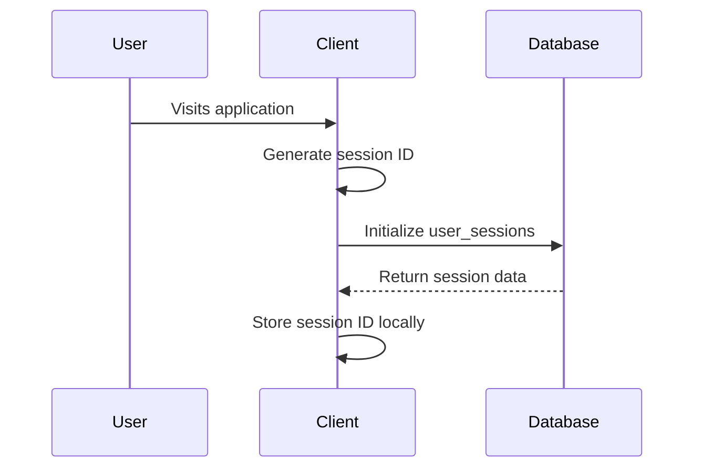
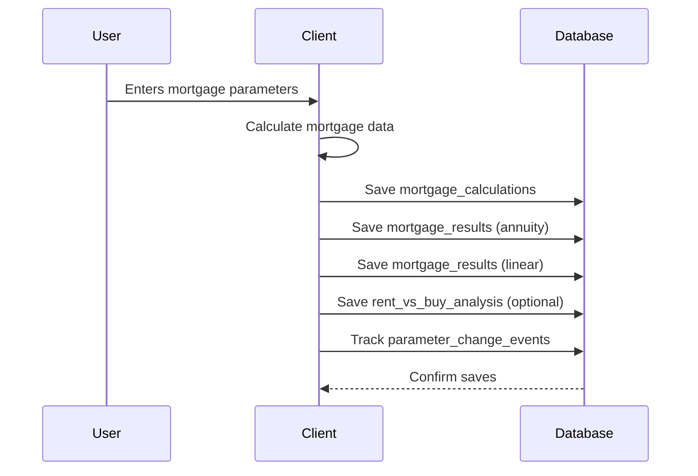
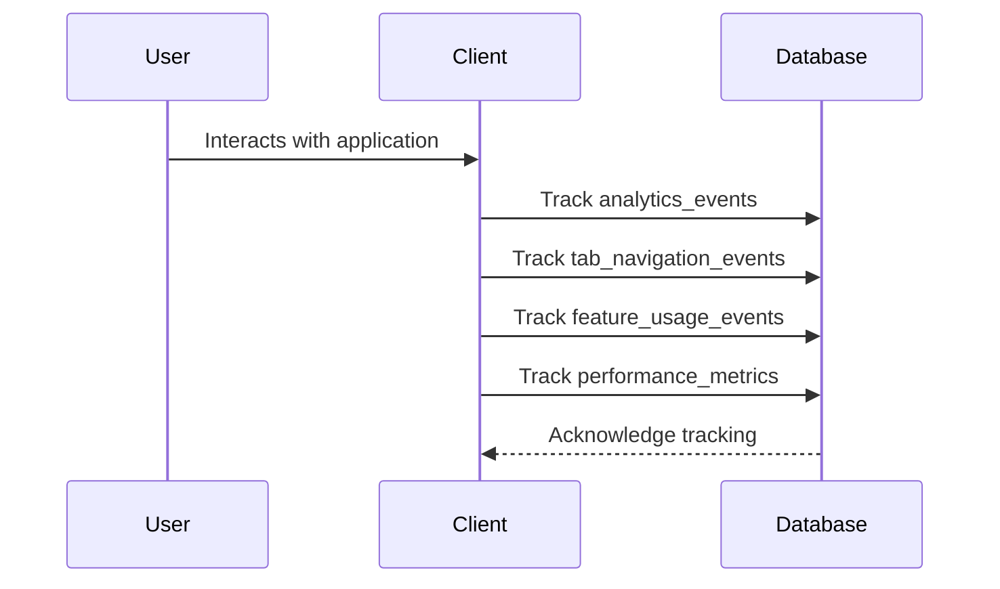

# Supabase Database Schema Documentation

## Overview

This document describes the comprehensive Supabase database schema designed for the mortgage calculator application. The schema is built with **GDPR compliance** as a core principle, storing only anonymous data without any personally identifiable information (PII).

## Table of Contents

- [Architecture Principles](#architecture-principles)
- [Database Tables](#database-tables)
- [Data Flow](#data-flow)
- [TypeScript Integration](#typescript-integration)
- [Analytics & Reporting](#analytics--reporting)
- [GDPR Compliance](#gdpr-compliance)
- [Performance Considerations](#performance-considerations)
- [Setup Instructions](#setup-instructions)

## Architecture Principles

### 1. **GDPR Compliance by Design**
- No personally identifiable information (PII) stored
- Anonymous user sessions with consent tracking
- Automatic data anonymization after retention periods
- User agent hashing for privacy protection

### 2. **Analytics-First Design**
- Comprehensive event tracking for user behavior analysis
- Structured data for business intelligence queries
- Performance metrics collection for optimization
- Feature usage tracking for product insights

### 3. **Scalable Structure**
- Optimized indexes for query performance
- Partitioned tables for large datasets
- Materialized views for complex analytics
- Row-level security for data protection

### 4. **Developer Experience**
- Full TypeScript type definitions
- Helper functions for data transformation
- Batch operations for efficiency
- Real-time subscriptions support

## Database Tables

### Core Tables

#### `user_sessions`
Anonymous user sessions with device and browser information.

```sql
CREATE TABLE user_sessions (
    id UUID PRIMARY KEY,
    session_id TEXT UNIQUE NOT NULL,
    created_at TIMESTAMP WITH TIME ZONE,
    updated_at TIMESTAMP WITH TIME ZONE,
    device_type device_type,
    browser_type browser_type,
    screen_resolution TEXT,
    timezone TEXT,
    language TEXT,
    user_agent_hash TEXT,
    is_returning_user BOOLEAN,
    user_segment user_segment,
    session_duration_ms INTEGER,
    page_views INTEGER,
    calculations_count INTEGER,
    tabs_navigated INTEGER,
    analytics_consent_given BOOLEAN,
    consent_timestamp TIMESTAMP WITH TIME ZONE,
    referrer_domain TEXT,
    utm_source TEXT,
    utm_medium TEXT,
    utm_campaign TEXT
);
```

**Key Features:**
- Anonymous session tracking
- Device fingerprinting (hashed)
- UTM parameter capture
- Consent management
- Activity metrics

#### `mortgage_calculations`
Stores mortgage calculation parameters and basic results.

```sql
CREATE TABLE mortgage_calculations (
    id UUID PRIMARY KEY,
    session_id UUID REFERENCES user_sessions(id),
    calculation_id TEXT NOT NULL,
    created_at TIMESTAMP WITH TIME ZONE,
    property_price DECIMAL(12,2),
    interest_rate DECIMAL(5,3),
    tax_deduction_rate DECIMAL(5,2),
    savings_amount DECIMAL(12,2),
    monthly_rent DECIMAL(8,2),
    -- Purchase costs
    notary_cost DECIMAL(8,2),
    valuation_cost DECIMAL(8,2),
    financial_advisor_cost DECIMAL(8,2),
    real_estate_agent_cost DECIMAL(8,2),
    structural_survey_cost DECIMAL(8,2),
    -- Tax settings
    is_first_time_buyer BOOLEAN,
    transfer_tax_rate DECIMAL(5,2),
    -- Rent vs Buy comparison
    property_appreciation_rate DECIMAL(5,2),
    comparison_period_years INTEGER,
    -- Calculated results
    loan_amount DECIMAL(12,2),
    total_cost DECIMAL(12,2),
    loan_to_value_percentage DECIMAL(5,2),
    transfer_tax_amount DECIMAL(12,2),
    transfer_tax_exempt BOOLEAN,
    -- Metadata
    calculation_status calculation_status,
    calculation_duration_ms INTEGER,
    error_message TEXT,
    user_segment user_segment
);
```

**Key Features:**
- Complete mortgage parameters
- Purchase cost breakdown
- Tax calculation details
- Performance metrics
- Error tracking

#### `mortgage_results`
Detailed monthly payment data for both mortgage types.

```sql
CREATE TABLE mortgage_results (
    id UUID PRIMARY KEY,
    calculation_id UUID REFERENCES mortgage_calculations(id),
    mortgage_type mortgage_type NOT NULL,
    created_at TIMESTAMP WITH TIME ZONE,
    -- Totals
    total_paid_gross DECIMAL(12,2),
    total_paid_net DECIMAL(12,2),
    total_interest_gross DECIMAL(12,2),
    total_interest_net DECIMAL(12,2),
    total_invested_gross DECIMAL(12,2),
    total_invested_net DECIMAL(12,2),
    -- Monthly data (JSON)
    monthly_payments JSONB NOT NULL
);
```

**Key Features:**
- Separate records for annuity and linear
- Summary totals for quick access
- Detailed monthly breakdown in JSON
- Foreign key relationships

### Analytics Tables

#### `analytics_events`
Generic analytics events with flexible properties.

```sql
CREATE TABLE analytics_events (
    id UUID PRIMARY KEY,
    session_id UUID REFERENCES user_sessions(id),
    event_type TEXT NOT NULL,
    created_at TIMESTAMP WITH TIME ZONE,
    properties JSONB NOT NULL DEFAULT '{}',
    page_url TEXT,
    page_title TEXT,
    referrer TEXT,
    device_type device_type,
    browser_type browser_type
);
```

#### `tab_navigation_events`
Specialized tracking for tab navigation patterns.

```sql
CREATE TABLE tab_navigation_events (
    id UUID PRIMARY KEY,
    session_id UUID REFERENCES user_sessions(id),
    created_at TIMESTAMP WITH TIME ZONE,
    from_tab TEXT,
    to_tab TEXT,
    tab_category tab_category NOT NULL,
    navigation_method TEXT,
    time_spent_on_previous_tab INTEGER,
    calculation_id UUID REFERENCES mortgage_calculations(id)
);
```

#### `feature_usage_events`
Tracks usage of specific calculator features.

```sql
CREATE TABLE feature_usage_events (
    id UUID PRIMARY KEY,
    session_id UUID REFERENCES user_sessions(id),
    created_at TIMESTAMP WITH TIME ZONE,
    feature_name TEXT NOT NULL,
    feature_category TEXT NOT NULL,
    action TEXT NOT NULL,
    feature_value TEXT,
    feature_context JSONB DEFAULT '{}',
    calculation_id UUID REFERENCES mortgage_calculations(id)
);
```

#### `parameter_change_events`
Tracks changes to mortgage parameters.

```sql
CREATE TABLE parameter_change_events (
    id UUID PRIMARY KEY,
    session_id UUID REFERENCES user_sessions(id),
    calculation_id UUID REFERENCES mortgage_calculations(id),
    created_at TIMESTAMP WITH TIME ZONE,
    parameter_name TEXT NOT NULL,
    parameter_category TEXT NOT NULL,
    field_type TEXT NOT NULL,
    component_name TEXT NOT NULL,
    previous_value TEXT,
    new_value TEXT NOT NULL,
    validation_errors JSONB DEFAULT '[]'
);
```

### Specialized Tables

#### `rent_vs_buy_analysis`
Detailed rent vs buy comparison results.

```sql
CREATE TABLE rent_vs_buy_analysis (
    id UUID PRIMARY KEY,
    calculation_id UUID REFERENCES mortgage_calculations(id),
    created_at TIMESTAMP WITH TIME ZONE,
    property_price DECIMAL(12,2),
    monthly_rent DECIMAL(8,2),
    property_appreciation_rate DECIMAL(5,2),
    comparison_period_years INTEGER,
    break_even_year INTEGER,
    total_buying_cost DECIMAL(12,2),
    total_renting_cost DECIMAL(12,2),
    net_worth_difference DECIMAL(12,2),
    yearly_breakdown JSONB NOT NULL
);
```

#### `error_events`
Comprehensive error tracking for debugging.

```sql
CREATE TABLE error_events (
    id UUID PRIMARY KEY,
    session_id UUID REFERENCES user_sessions(id),
    created_at TIMESTAMP WITH TIME ZONE,
    error_type TEXT NOT NULL,
    error_message TEXT NOT NULL,
    error_stack TEXT,
    component_name TEXT,
    user_action TEXT,
    calculation_id UUID REFERENCES mortgage_calculations(id),
    browser_type browser_type,
    device_type device_type,
    user_agent_hash TEXT
);
```

#### `performance_metrics`
Application performance tracking.

```sql
CREATE TABLE performance_metrics (
    id UUID PRIMARY KEY,
    session_id UUID REFERENCES user_sessions(id),
    created_at TIMESTAMP WITH TIME ZONE,
    metric_name TEXT NOT NULL,
    metric_value DECIMAL(10,3) NOT NULL,
    metric_unit TEXT NOT NULL,
    calculation_id UUID REFERENCES mortgage_calculations(id),
    component_name TEXT,
    device_type device_type,
    browser_type browser_type
);
```

## Data Flow

### 1. **Session Initialization**


### 2. **Mortgage Calculation Flow**


### 3. **Analytics Tracking Flow**


## TypeScript Integration

### Complete Type Definitions
The schema includes comprehensive TypeScript types:

```typescript
// Core types
export interface UserSession {
  id: string;
  session_id: string;
  created_at: string;
  device_type?: DeviceType;
  browser_type?: BrowserType;
  // ... full interface definition
}

export interface MortgageCalculation {
  id: string;
  session_id: string;
  property_price: number;
  interest_rate: number;
  // ... complete mortgage parameters
}
```

### Helper Functions
Utility functions for data transformation:

```typescript
export function transformAppStateToCalculation(
  appState: AppState,
  sessionId: string,
  calculationId: string,
  results: CalculationResults
): MortgageCalculationInsert;

export function getUserSegment(price: number): UserSegment;
export function getDeviceType(userAgent: string): DeviceType;
export function getBrowserType(userAgent: string): BrowserType;
```

### Database Service Class
Comprehensive service for all database operations:

```typescript
export class DatabaseService {
  async initializeSession(sessionData: Partial<UserSessionInsert>): Promise<DatabaseResponse<UserSession>>;
  async saveMortgageCalculation(calculation: MortgageCalculationInsert): Promise<DatabaseResponse<MortgageCalculation>>;
  async trackAnalyticsEvent(event: AnalyticsEventInsert): Promise<DatabaseResponse<AnalyticsEvent>>;
  // ... all database methods
}
```

## Analytics & Reporting

### Pre-built Views

#### `session_summary`
Aggregated session data with calculation counts:
```sql
CREATE VIEW session_summary AS
SELECT 
    us.id,
    us.session_id,
    us.device_type,
    us.user_segment,
    COUNT(mc.id) as actual_calculations,
    AVG(mc.property_price) as avg_property_price,
    COUNT(ee.id) as error_count
FROM user_sessions us
LEFT JOIN mortgage_calculations mc ON us.id = mc.session_id
LEFT JOIN error_events ee ON us.id = ee.session_id
GROUP BY us.id, ...;
```

#### `popular_features`
Feature usage analytics:
```sql
CREATE VIEW popular_features AS
SELECT 
    feature_name,
    feature_category,
    action,
    COUNT(*) as usage_count,
    COUNT(DISTINCT session_id) as unique_sessions
FROM feature_usage_events
GROUP BY feature_name, feature_category, action;
```

#### `calculation_trends`
Daily calculation trends by user segment:
```sql
CREATE VIEW calculation_trends AS
SELECT 
    DATE_TRUNC('day', created_at) as calculation_date,
    user_segment,
    COUNT(*) as calculation_count,
    AVG(property_price) as avg_property_price,
    COUNT(*) FILTER (WHERE is_first_time_buyer = true) as first_time_buyer_count
FROM mortgage_calculations
GROUP BY DATE_TRUNC('day', created_at), user_segment;
```

### Materialized Views

#### `performance_dashboard`
Real-time performance metrics:
```sql
CREATE MATERIALIZED VIEW performance_dashboard AS
SELECT 
    DATE_TRUNC('hour', created_at) as time_bucket,
    metric_name,
    AVG(metric_value) as avg_value,
    PERCENTILE_CONT(0.95) WITHIN GROUP (ORDER BY metric_value) as p95_value
FROM performance_metrics
GROUP BY DATE_TRUNC('hour', created_at), metric_name;
```

### Custom Functions

#### `get_session_insights`
Comprehensive session analysis:
```sql
CREATE FUNCTION get_session_insights(session_uuid UUID)
RETURNS TABLE (
    total_calculations INTEGER,
    avg_property_price DECIMAL,
    most_used_feature TEXT,
    session_duration_minutes INTEGER,
    error_count INTEGER
);
```

#### `get_user_segment`
Automatic user segmentation:
```sql
CREATE FUNCTION get_user_segment(price DECIMAL)
RETURNS user_segment AS $$
BEGIN
    CASE 
        WHEN price < 300000 THEN RETURN 'starter'::user_segment;
        WHEN price < 500000 THEN RETURN 'mid_market'::user_segment;
        WHEN price < 800000 THEN RETURN 'premium'::user_segment;
        ELSE RETURN 'luxury'::user_segment;
    END CASE;
END;
$$;
```

## GDPR Compliance

### Privacy by Design

1. **No PII Storage**
   - User agents are hashed
   - No email addresses or names
   - Anonymous session identifiers
   - IP addresses not stored

2. **Consent Management**
   - Explicit consent tracking
   - Consent timestamps
   - Granular consent options

3. **Data Retention**
   - Automatic anonymization after 2 years
   - Event cleanup after 1 year
   - Configurable retention periods

4. **Right to be Forgotten**
   - Session-based data deletion
   - Cascade delete relationships
   - Anonymization procedures

### Anonymization Function
```sql
CREATE FUNCTION anonymize_old_sessions()
RETURNS void AS $$
BEGIN
    UPDATE user_sessions 
    SET 
        user_agent_hash = 'anonymized',
        referrer_domain = 'anonymized',
        utm_source = NULL
    WHERE created_at < NOW() - INTERVAL '2 years';
END;
$$;
```

## Performance Considerations

### Indexing Strategy

#### Primary Indexes
- All tables have UUID primary keys
- Foreign key relationships are indexed
- Time-based queries use created_at indexes

#### Analytics Indexes
```sql
-- Session queries
CREATE INDEX idx_user_sessions_user_segment ON user_sessions(user_segment);
CREATE INDEX idx_user_sessions_device_type ON user_sessions(device_type);

-- Calculation queries
CREATE INDEX idx_mortgage_calculations_property_price ON mortgage_calculations(property_price);
CREATE INDEX idx_mortgage_calculations_user_segment ON mortgage_calculations(user_segment);

-- Event queries
CREATE INDEX idx_analytics_events_event_type ON analytics_events(event_type);
CREATE INDEX idx_analytics_events_properties ON analytics_events USING GIN(properties);
```

#### Composite Indexes
```sql
-- Time-range queries with filters
CREATE INDEX idx_calculations_date_segment ON mortgage_calculations(created_at, user_segment);
CREATE INDEX idx_events_date_type ON analytics_events(created_at, event_type);
```

### Query Optimization

#### Partitioning Strategy
For large datasets, consider partitioning by date:
```sql
-- Example partitioning for analytics_events
CREATE TABLE analytics_events_2025_01 PARTITION OF analytics_events
FOR VALUES FROM ('2025-01-01') TO ('2025-02-01');
```

#### Connection Pooling
Configure Supabase connection pooling for high-traffic scenarios:
```typescript
const supabase = createClient(url, key, {
  db: {
    schema: 'public',
  },
  global: {
    headers: { 'x-my-custom-header': 'my-app-name' },
  },
});
```

## Setup Instructions

### 1. Database Setup

#### Create Supabase Project
1. Go to [Supabase Dashboard](https://app.supabase.com)
2. Create new project
3. Note the project URL and anon key

#### Run Schema Migration
```sql
-- Execute the complete schema file
\i supabase-schema.sql
```

### 2. Environment Configuration

#### Environment Variables
```env
NEXT_PUBLIC_SUPABASE_URL=your_project_url
NEXT_PUBLIC_SUPABASE_ANON_KEY=your_anon_key
```

#### TypeScript Configuration
```typescript
// Import types and service
import { db, createSessionData } from '@/lib/supabase';
import type { MortgageCalculation, UserSession } from '@/types/database';
```

### 3. Application Integration

#### Initialize Session
```typescript
import { db, createSessionData } from '@/lib/supabase';

// Initialize user session
const sessionData = createSessionData();
const { data: session, error } = await db.initializeSession({
  ...sessionData,
  analytics_consent_given: consentGiven,
});
```

#### Save Calculations
```typescript
// Save complete calculation
const result = await db.saveCompleteCalculation(
  sessionId,
  appState,
  calculationResults,
  annuityData,
  linearData,
  rentVsBuyData
);
```

#### Track Events
```typescript
// Track user interactions
await db.trackFeatureUsage({
  session_id: sessionId,
  feature_name: 'first_time_buyer_toggle',
  feature_category: 'tax_benefits',
  action: 'enabled',
});
```

### 4. Analytics Queries

#### Basic Analytics
```typescript
// Get session summary
const { data: sessions } = await db.getSessionSummary({
  user_segment: 'premium',
  date_from: '2025-01-01',
  has_calculations: true,
});

// Get popular features
const { data: features } = await db.getPopularFeatures(10);

// Get calculation trends
const { data: trends } = await db.getCalculationTrends(30);
```

#### Advanced Analytics
```typescript
// Get session insights
const { data: insights } = await db.getSessionInsights(sessionId);

// Custom queries
const { data } = await supabase
  .from('mortgage_calculations')
  .select(`
    *,
    mortgage_results(*),
    rent_vs_buy_analysis(*)
  `)
  .eq('user_segment', 'luxury')
  .gte('property_price', 800000);
```

### 5. Monitoring & Maintenance

#### Automated Cleanup
Set up scheduled functions for data maintenance:
```sql
-- Schedule cleanup (requires pg_cron extension)
SELECT cron.schedule(
  'cleanup-old-data', 
  '0 2 * * *', 
  'SELECT anonymize_old_sessions();'
);
```

#### Performance Monitoring
```typescript
// Track performance metrics
await db.trackPerformanceMetric({
  session_id: sessionId,
  metric_name: 'calculation_duration',
  metric_value: calculationTime,
  metric_unit: 'ms',
  component_name: 'MortgageCalculator',
});
```

#### Error Handling
```typescript
// Track errors for monitoring
await db.trackError({
  session_id: sessionId,
  error_type: 'calculation_error',
  error_message: error.message,
  error_stack: error.stack,
  component_name: 'FormulaCalculation',
});
```

## Best Practices

### 1. **Data Privacy**
- Always check consent before storing analytics
- Hash sensitive identifiers
- Implement data retention policies
- Regular security audits

### 2. **Performance**
- Use batch operations for multiple inserts
- Implement proper indexing
- Monitor query performance
- Use materialized views for complex analytics

### 3. **Error Handling**
- Graceful degradation for database failures
- Comprehensive error logging
- Retry mechanisms for transient failures
- Fallback to local storage when needed

### 4. **Testing**
- Unit tests for database functions
- Integration tests for service methods
- Performance tests for high-load scenarios
- Data consistency validation

This comprehensive database schema provides a solid foundation for storing mortgage calculation data while maintaining GDPR compliance and enabling powerful analytics capabilities.