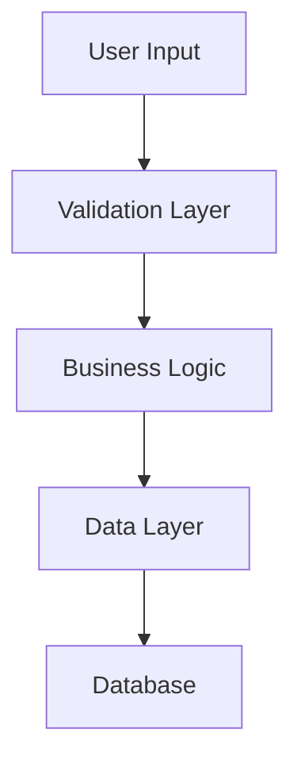

# TODO #{XXX}: {Full Descriptive Title}

## Overview
{Provide a clear description of what needs to be done and why. This should be 2-3 sentences that explain the task and its value.}

### User Story
As a {type of user},
I want {goal/desire},
So that {benefit/value}.

### Background
{Additional context about why this task exists:}
- {Historical context}
- {Previous attempts or related work}
- {Business justification}

## Motivation
### Business Value
{Explain the business impact:}
- **User Benefit**: {How this helps users}
- **Business Benefit**: {ROI, efficiency gains, cost savings}
- **Technical Benefit**: {Debt reduction, performance, maintainability}

### Priority Justification
{Why this priority level:}
- **Urgency**: {Time-sensitive factors}
- **Impact**: {Number of users affected, severity}
- **Dependencies**: {What this blocks or enables}

## Requirements

### Functional Requirements
- [ ] **REQ-1**: {Clear, testable requirement}
  - Acceptance: {How to verify this is met}
- [ ] **REQ-2**: {Clear, testable requirement}
  - Acceptance: {How to verify this is met}
- [ ] **REQ-3**: {Clear, testable requirement}
  - Acceptance: {How to verify this is met}

### Non-Functional Requirements
- [ ] **Performance**: {e.g., Response time < 200ms}
- [ ] **Security**: {e.g., Input validation, authentication required}
- [ ] **Accessibility**: {e.g., WCAG 2.1 AA compliance}
- [ ] **Compatibility**: {e.g., Browser support, API versioning}
- [ ] **Usability**: {e.g., Intuitive UI, clear error messages}

### Out of Scope
{Explicitly state what this task does NOT include:}
- {Feature or functionality not included}
- {Optimization not being done}
- {Integration not being built}

## Technical Details

### Current State
{Describe the current implementation:}
- How it works today
- Limitations or issues
- Technical debt present

### Proposed Architecture
{High-level technical approach:}



### Components Affected
| Component | Type of Change | Impact |
|-----------|---------------|---------|
| `src/components/{Component}.tsx` | Modify | {Description} |
| `src/utils/{util}.ts` | Create | {Description} |
| `src/api/{endpoint}.ts` | Update | {Description} |
| `src/styles/{style}.css` | Add | {Description} |

### Data Model Changes
```typescript
// Current model
interface CurrentModel {
  // existing fields
}

// Proposed model  
interface ProposedModel {
  // new/modified fields
}
```

### API Changes
**New Endpoints**:
```
POST /api/v1/{resource}
GET /api/v1/{resource}/{id}
```

**Modified Endpoints**:
```
PUT /api/v1/{resource}/{id}
- Added field: {field_name}
- Deprecated field: {old_field}
```

### Database Changes
```sql
-- Migration script preview
ALTER TABLE {table_name}
ADD COLUMN {column_name} {type};

CREATE INDEX idx_{name} ON {table}({column});
```

## Implementation Plan

### Pre-Implementation Checklist
- [ ] Design reviewed and approved
- [ ] Dependencies available
- [ ] Test environment ready
- [ ] Performance baseline measured
- [ ] Security review completed

### Phase 1: Foundation ({X} hours)
**Goal**: {What this phase accomplishes}

**Tasks**:
- [ ] **TASK-1.1**: Set up development environment
  - Create feature branch: `feature/todo-{XXX}-{name}`
  - Install dependencies
  - Configure local testing
  
- [ ] **TASK-1.2**: Create basic structure
  - Add new components
  - Set up routing
  - Create placeholder UI

**Definition of Done**:
- [ ] Code compiles without errors
- [ ] Basic structure in place
- [ ] Unit tests for utilities

### Phase 2: Core Implementation ({X} hours)
**Goal**: {What this phase accomplishes}

**Tasks**:
- [ ] **TASK-2.1**: Implement business logic
  - {Specific implementation detail}
  - {Specific implementation detail}
  
- [ ] **TASK-2.2**: Build UI components
  - {Component 1}
  - {Component 2}
  
- [ ] **TASK-2.3**: Connect to backend
  - API integration
  - Error handling
  - Loading states

**Definition of Done**:
- [ ] All functional requirements met
- [ ] Unit test coverage > 80%
- [ ] Integration tests passing

### Phase 3: Polish & Testing ({X} hours)
**Goal**: {What this phase accomplishes}

**Tasks**:
- [ ] **TASK-3.1**: UI/UX improvements
  - Animations and transitions
  - Responsive design
  - Accessibility features
  
- [ ] **TASK-3.2**: Performance optimization
  - Code splitting
  - Lazy loading
  - Caching strategy
  
- [ ] **TASK-3.3**: Comprehensive testing
  - Edge cases
  - Error scenarios
  - Load testing

**Definition of Done**:
- [ ] All tests passing
- [ ] Performance benchmarks met
- [ ] Code review approved

### Phase 4: Documentation & Deployment ({X} hours)
**Goal**: {What this phase accomplishes}

**Tasks**:
- [ ] **TASK-4.1**: Documentation
  - User documentation
  - API documentation
  - Code comments
  
- [ ] **TASK-4.2**: Deployment preparation
  - Environment configuration
  - Migration scripts
  - Rollback plan
  
- [ ] **TASK-4.3**: Release
  - Deploy to staging
  - Verify in staging
  - Deploy to production

**Definition of Done**:
- [ ] Documentation complete
- [ ] Successfully deployed
- [ ] Monitoring in place

## Acceptance Criteria
### Functional Acceptance
- [ ] {User can perform action X}
- [ ] {System responds with Y when Z happens}
- [ ] {Data is validated according to rules}
- [ ] {Error messages are clear and actionable}

### Technical Acceptance  
- [ ] Code follows project style guide
- [ ] No linting errors
- [ ] Test coverage ≥ 80%
- [ ] Performance metrics met
- [ ] Security scan passed
- [ ] Accessibility audit passed

### User Experience Acceptance
- [ ] UI matches design mockups
- [ ] Interactions feel responsive (< 100ms feedback)
- [ ] Works on all supported browsers
- [ ] Mobile experience is optimized
- [ ] Error states are handled gracefully

## Testing Strategy

### Unit Tests
```typescript
describe('{Component/Function}', () => {
  it('should {expected behavior}', () => {
    // Test case 1
  });
  
  it('should handle {edge case}', () => {
    // Test case 2
  });
});
```

**Test Coverage Goals**:
- Statements: > 80%
- Branches: > 75%
- Functions: > 80%
- Lines: > 80%

### Integration Tests
- [ ] **Test Scenario 1**: {End-to-end flow}
  - Setup: {Initial state}
  - Actions: {User actions}
  - Expected: {Outcome}
  
- [ ] **Test Scenario 2**: {Error handling flow}
  - Setup: {Initial state}
  - Actions: {User actions that cause error}
  - Expected: {Error handling}

### Performance Tests
| Metric | Current | Target | Test Method |
|--------|---------|--------|-------------|
| Page Load | {X}ms | < {Y}ms | Lighthouse |
| API Response | {X}ms | < {Y}ms | Load test |
| Memory Usage | {X}MB | < {Y}MB | Chrome DevTools |

### Manual Testing Checklist
- [ ] **Happy Path**: {Primary user flow}
- [ ] **Edge Cases**: {Boundary conditions}
- [ ] **Error Cases**: {Invalid inputs, network errors}
- [ ] **Browser Testing**: Chrome, Firefox, Safari, Edge
- [ ] **Device Testing**: Desktop, Tablet, Mobile
- [ ] **Accessibility**: Keyboard navigation, screen reader

## Documentation Updates
### Code Documentation
- [ ] JSDoc comments for all public methods
- [ ] README updated with new features
- [ ] API documentation generated
- [ ] Architecture diagrams updated

### User Documentation  
- [ ] User guide updated
- [ ] FAQ section added
- [ ] Video tutorial created
- [ ] Release notes drafted

### Developer Documentation
- [ ] Setup instructions updated
- [ ] Contribution guidelines updated
- [ ] Troubleshooting guide expanded
- [ ] Example code provided

## Dependencies

### Blocking Dependencies
{Tasks or issues that must be completed first:}
- [ ] TODO #{XXX}: {Title} - {Why it blocks}
- [ ] Issue #{XXX}: {Title} - {Why it blocks}
- [ ] External: {Third-party API availability}

### Blocked Tasks
{Tasks that depend on this:}
- [ ] TODO #{XXX}: {Title} - {What it needs from this}
- [ ] TODO #{XXX}: {Title} - {What it needs from this}

### Technical Dependencies
- **Libraries**: 
  - {library@version} - {purpose}
  - {library@version} - {purpose}
- **Services**:
  - {Service name} - {purpose}
- **APIs**:
  - {API name} - {endpoint needed}

## Risk Assessment

### Technical Risks
| Risk | Probability | Impact | Mitigation | Contingency |
|------|------------|--------|------------|-------------|
| Performance degradation | Medium | High | Load testing, profiling | Caching, optimization |
| Breaking changes | Low | High | Extensive testing | Feature flag, rollback |
| Integration issues | Medium | Medium | Early integration testing | Mock services |

### Schedule Risks  
| Risk | Probability | Impact | Mitigation | Contingency |
|------|------------|--------|------------|-------------|
| Underestimated complexity | Medium | Medium | Spike investigation | Scope reduction |
| Dependencies delayed | Low | High | Regular check-ins | Alternative approach |

### Mitigation Strategies
1. **Daily Progress Checks**: Identify blockers early
2. **Incremental Delivery**: Ship in small pieces
3. **Feature Flags**: Safe rollout and rollback
4. **Monitoring**: Detect issues quickly

## Notes

### Design Decisions
- **Decision 1**: {What was decided and why}
- **Decision 2**: {What was decided and why}
- **Trade-off**: {What we chose to optimize for}

### Open Questions
- [ ] **Q1**: {Question that needs answering}
  - Options: {Possible answers}
  - Impact: {How this affects implementation}
  
- [ ] **Q2**: {Question that needs answering}
  - Options: {Possible answers}
  - Impact: {How this affects implementation}

### Research Findings
- **Finding 1**: {What was discovered}
  - Source: {Where this came from}
  - Impact: {How this affects our approach}

### Alternative Approaches Considered
1. **Approach A**: {Description}
   - Pros: {Benefits}
   - Cons: {Drawbacks}
   - Rejected because: {Reason}

2. **Approach B**: {Description}
   - Pros: {Benefits}
   - Cons: {Drawbacks}
   - Rejected because: {Reason}

## References
### External Resources
- [{Article/Doc Title}]({URL}) - {Why relevant}
- [{Tutorial Title}]({URL}) - {Implementation guide}
- [{Library Docs}]({URL}) - {API reference}

### Internal Resources  
- [Design Mockups]({Figma/Sketch link})
- [PRD]({Product requirements doc})
- [Architecture Diagram]({Link})
- [Related ADR]({Link to ADR})

### Similar Implementations
- [{Project/Feature}]({Link}) - {What we can learn}
- [{Open Source Example}]({GitHub link}) - {Reference implementation}

## Progress Log
### Updates
- {YYYY-MM-DD}: Task created by {name}
- {YYYY-MM-DD}: Design review completed
- {YYYY-MM-DD}: Implementation started
- {YYYY-MM-DD}: Phase 1 completed
- {YYYY-MM-DD}: Blocker encountered: {description}
- {YYYY-MM-DD}: Blocker resolved
- {YYYY-MM-DD}: Code review feedback addressed
- {YYYY-MM-DD}: Deployed to staging
- {YYYY-MM-DD}: Task completed

### Time Tracking
| Phase | Estimated | Actual | Variance | Notes |
|-------|-----------|--------|----------|-------|
| Phase 1 | {X}h | {Y}h | {+/-Z}h | {Why different} |
| Phase 2 | {X}h | {Y}h | {+/-Z}h | {Why different} |
| Phase 3 | {X}h | {Y}h | {+/-Z}h | {Why different} |
| Phase 4 | {X}h | {Y}h | {+/-Z}h | {Why different} |
| **Total** | {X}h | {Y}h | {+/-Z}h | {Overall assessment} |

### Retrospective
**What Went Well**:
- {Success 1}
- {Success 2}

**What Could Improve**:
- {Improvement 1}
- {Improvement 2}

**Lessons Learned**:
- {Lesson 1}
- {Lesson 2}

---

*Template Version: 1.0*
*Last Updated: 2024-01-15*

<!-- 
INSTRUCTIONS FOR USE:
1. Copy this template to a new file with the naming convention: todo_{priority}_{kebab-case-title}.md
2. Replace all {placeholders} with actual content
3. Remove any sections that aren't applicable to your task
4. Use checkboxes [ ] to track progress
5. Keep the Progress Log updated as you work
6. Story points: 1=trivial, 2=small, 3=medium, 5=large, 8=extra large, 13=epic
7. Delete this instruction block
--> 