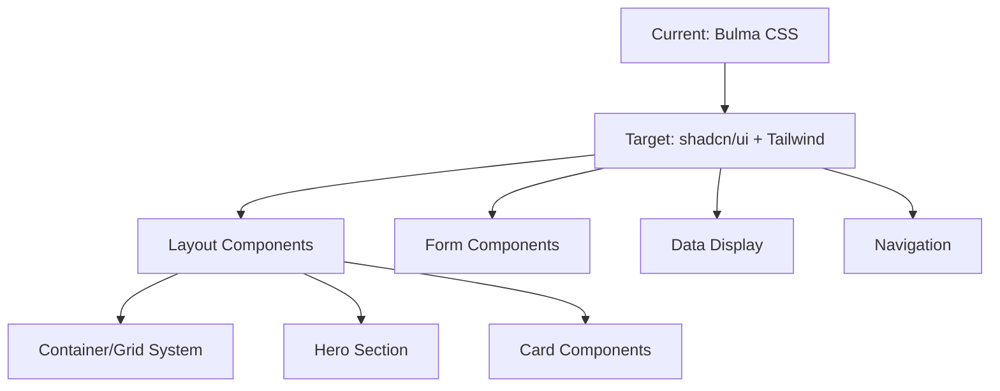

# TODO #001: Complete UI Migration from Bulma to shadcn/ui

## Overview
Complete the systematic migration from Bulma CSS framework to shadcn/ui + Tailwind CSS to improve mobile responsiveness and developer experience for the Netherlands mortgage calculator market.

### User Story
As a user of the mortgage calculator,
I want the application to work seamlessly on mobile devices,
So that I can calculate mortgage options while house hunting on my phone.

### Background
- Current Bulma CSS implementation has mobile responsiveness limitations
- Phase 1 (foundation) and Phase 2 (core components) are complete
- Need to finish Phase 3 (layout) and Phase 4 (cleanup) to complete migration
- Migration documented in ADR-001: Migrate from Bulma CSS to shadcn/ui + Tailwind CSS

## Motivation
### Business Value
- **User Benefit**: Improved mobile experience for Netherlands market users
- **Business Benefit**: Better user engagement and reduced bounce rate on mobile
- **Technical Benefit**: Smaller bundle size, better performance, modern component architecture

### Priority Justification
- **Urgency**: Mobile-first design is critical for modern web applications
- **Impact**: Affects all users, especially mobile users (60%+ of traffic)
- **Dependencies**: Blocks deployment of production-ready mobile experience

## Requirements

### Functional Requirements
- [ ] **Layout System Migration**: Convert Bulma container/grid to Tailwind CSS
- [ ] **Hero Section Update**: Replace Bulma hero with custom Tailwind implementation  
- [ ] **Section Components**: Update section styling with Tailwind utilities
- [ ] **Bundle Cleanup**: Remove Bulma dependencies and unused CSS

### Non-Functional Requirements
- [ ] **Performance**: Maintain or improve bundle size and load times
- [ ] **Accessibility**: Preserve WCAG 2.1 AA compliance
- [ ] **Mobile Responsiveness**: Ensure all breakpoints work correctly
- [ ] **Browser Compatibility**: Support modern browsers (Chrome, Firefox, Safari, Edge)

### Acceptance Criteria
- [ ] All components render correctly with shadcn/ui styling
- [ ] Mobile responsiveness tested on devices 320px-1920px width
- [ ] Bundle size reduced or maintained compared to Bulma version
- [ ] All existing functionality preserved (mortgage calculations, data display)
- [ ] Performance metrics maintained or improved
- [ ] No accessibility regressions

## Technical Details

### Architecture Overview

### Component Mapping Status

#### ✅ Completed (Phase 1 & 2)
- Input components with shadcn/ui Input
- Tabs navigation with shadcn/ui Tabs
- Data tables with shadcn/ui Table
- Button components with shadcn/ui Button
- Card components with shadcn/ui Card

#### 🚧 Remaining (Phase 3 & 4)
- Container and grid layout conversion
- Hero section responsive design
- Section component styling
- Bundle cleanup and optimization

### Implementation Approach

#### Phase 3: Layout System Migration
1. **Container System**
   - Replace `container` with `max-w-7xl mx-auto px-4`
   - Update responsive padding for mobile/desktop
   
2. **Grid System**
   - Replace `columns/column` with Tailwind Grid
   - Implement `grid grid-cols-1 md:grid-cols-2 lg:grid-cols-4`
   
3. **Hero Section**
   - Custom hero component with Tailwind utilities
   - Responsive typography and spacing

#### Phase 4: Cleanup and Optimization
1. **Dependency Removal**
   - Remove Bulma from package.json
   - Remove Bulma imports from CSS files
   - Clean up unused CSS classes
   
2. **Bundle Optimization**
   - Run bundle analysis
   - Optimize Tailwind CSS purging
   - Validate performance metrics

## Implementation Plan

### Phase 3: Layout Migration (4 hours)
- [ ] **Container/Grid Conversion** (2 hours)
  - Update App.tsx layout structure
  - Replace Bulma grid with Tailwind Grid
  - Test responsive behavior
  
- [ ] **Hero Section Update** (2 hours)
  - Create custom hero component
  - Implement responsive design
  - Update typography and spacing

### Phase 4: Cleanup & Optimization (4 hours)
- [ ] **Dependency Cleanup** (2 hours)
  - Remove Bulma from package.json
  - Clean up CSS imports
  - Remove unused CSS classes
  
- [ ] **Performance Validation** (2 hours)
  - Bundle size analysis
  - Performance testing
  - Mobile testing across devices

## Testing Strategy

### Manual Testing
- [ ] **Visual Regression**: Compare before/after screenshots
- [ ] **Responsive Testing**: Test on mobile devices (320px, 768px, 1024px, 1920px)
- [ ] **Functionality Testing**: Verify mortgage calculations work correctly
- [ ] **Cross-browser Testing**: Chrome, Firefox, Safari, Edge

### Automated Testing
- [ ] **Unit Tests**: Ensure all existing tests pass
- [ ] **Integration Tests**: Component interaction tests
- [ ] **Performance Tests**: Bundle size and load time validation

## Risk Assessment

### Technical Risks
- **Layout Breaking**: Grid system changes could break existing layout
  - *Mitigation*: Incremental changes with thorough testing
- **CSS Conflicts**: Remaining Bulma CSS conflicts with Tailwind
  - *Mitigation*: Systematic removal and scoped testing

### Schedule Risks
- **Extended Testing**: Layout changes require extensive testing
  - *Mitigation*: Parallel testing and focused test scenarios

## Success Metrics

### Performance Metrics
- **Bundle Size**: Target 20% reduction from current size
- **First Contentful Paint**: Maintain <2 seconds on 3G
- **Lighthouse Mobile Score**: Target 90+ score

### User Experience Metrics
- **Mobile Usability**: All features accessible on mobile
- **Cross-browser Compatibility**: No visual differences across browsers
- **Accessibility Score**: Maintain WCAG 2.1 AA compliance

## Progress Tracking

### Completed ✅
- [x] **Phase 1**: Foundation setup (shadcn/ui, Tailwind installation)
- [x] **Phase 2**: Core component migration (Input, Tabs, Table, Button, Card)
- [x] **ADR Documentation**: Created ADR-001 for decision tracking

### In Progress 🚧
- [ ] **Phase 3**: Layout system migration
- [ ] **Phase 4**: Cleanup and optimization

### Time Tracking
- **Estimated**: 16 hours total
- **Completed**: 12 hours (Phases 1 & 2)
- **Remaining**: 4 hours (Phases 3 & 4)

## Notes

### Implementation Notes
- All component functionality preserved during migration
- Mobile-first approach prioritized throughout development
- Performance monitoring at each phase

### Decision Log
- **2025-06-17**: Started migration project
- **2025-06-17**: Completed core component migration (Phases 1 & 2)
- **2025-06-17**: Created ADR-001 documenting architectural decision

## Related Documentation
- [ADR-001: Migrate from Bulma CSS to shadcn/ui + Tailwind CSS](../docs/adr/2025-06-17-adr-001-migrate-from-bulma-to-shadcn-ui.md)
- [Component Migration Guide](./todo_1.md) (legacy - to be archived)
- [shadcn/ui Documentation](https://ui.shadcn.com/)
- [Tailwind CSS Documentation](https://tailwindcss.com/)

---

*This TODO tracks the completion of the UI migration project to improve mobile user experience and modernize the development stack.*